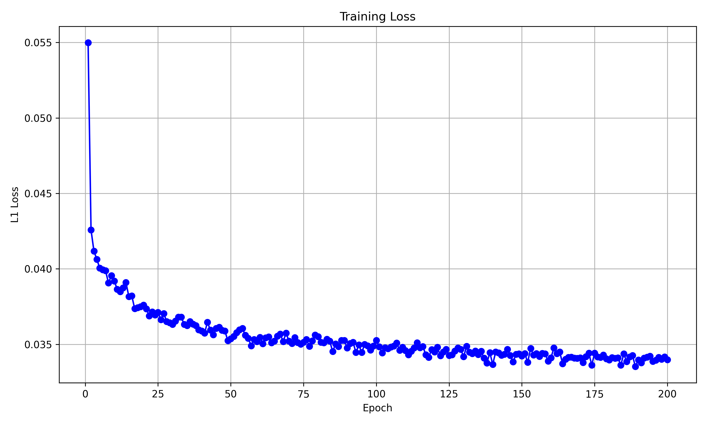
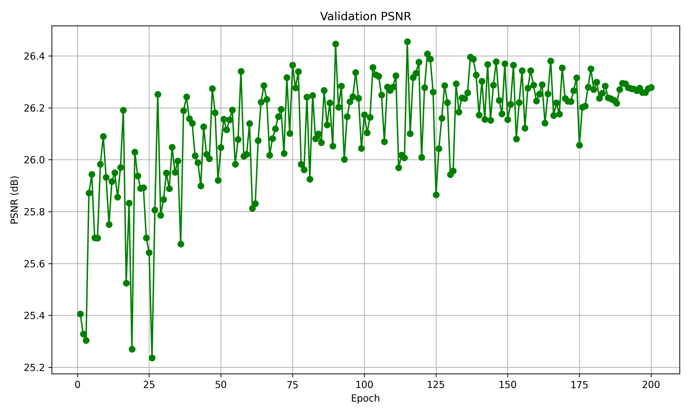

# 🧑‍🦰✨ Blind Face Super-Resolution

A Residual Channel-Attention Network (RCAN) that restores 128×128 low-quality face crops
to 512×512 high-resolution images, under a *blind* setting: the degradations applied to
the training data (blur, resize, noise, JPEG compression) are randomized second-order
corruptions rather than a single known downsampling kernel, following the
[Real-ESRGAN](https://github.com/xinntao/Real-ESRGAN) degradation pipeline.

Full write-up (architecture rationale, training curves, held-out evaluation result):
[Report.pdf](Report.pdf).

## 📊 Results

- 🧮 **1,824,595** parameters.
- 📈 Best validation PSNR during training: **~26.4 dB** (200 epochs, checkpoint selected by
  highest validation PSNR).
- 🏆 Held-out test-set (400 images) PSNR: **26.61 dB**.

| Training loss | Validation PSNR |
|---|---|
|  |  |

Both curves are produced automatically at the end of `train.py` and saved to
`training_loss.png` / `validation_psnr.png`.

## 🧠 Model

`model.py` implements RCAN:

- **Head**: one 3×3 conv, 3 → 64 channels.
- **Body**: 20 stacked Residual Channel-Attention Blocks (RCAB), each two 3×3 convs
  (64 → 64) with a ReLU in between, followed by a channel-attention (squeeze-and-excite)
  gate, plus a local residual (skip) connection. A final 3×3 conv mixes the 20 blocks'
  output, and a global skip adds back the head's shallow features.
- **Tail**: two pixel-shuffle upsampling stages (3×3 conv 64 → 256 channels + `PixelShuffle(2)`
  + ReLU), giving a 4× spatial upscale, followed by a 3×3 conv back to 3 RGB channels.

The network is randomly initialized and trained end-to-end from scratch with an L1
reconstruction loss — no adversarial or perceptual loss, no pretraining.

## 🗂️ Repository layout

```
model.py                          RCAN architecture
main.py                           Entry point: wires up datasets, model, train/inference
train.py                          Training loop, validation, loss/PSNR plotting
test.py                           Inference loop over the test set
infer.py                          Standalone script for a BasicSR MSRResNet checkpoint (reference/alt path)
evaluate.py                       Scoring script comparing predictions vs. ground truth (res/ref layout)
utils.py                          CLI args, options dict, the Real-ESRGAN-style degradation pipeline, PSNR
data_loader.py                    DataLoader factory (train/val/test)
ffhqsub_dataset.py                Training dataset: loads GT faces + per-sample blur kernels
val_400_dataset.py                Validation dataset: paired LQ/GT
test_400_dataset.py               Test dataset: LQ only (+ filename, for saving predictions)
train_SRResNet_x4_FFHQ_300k.yml   Reference BasicSR/Real-ESRGAN config the degradation params mirror
model.pth                         Best checkpoint (highest validation PSNR)
Report.pdf                        Technical write-up (architecture, training, results)
```

## 🗃️ Data

Expects an FFHQ-derived split laid out as:

```
data/
├── train/
│   ├── GT/                                    6000 ground-truth face images
│   └── meta_info_FFHQ6000sub_GT.txt           list of GT filenames
├── val/
│   ├── GT/                                    400 ground-truth images
│   └── LQ/                                    400 paired low-quality images
└── test/
    └── LQ/                                    400 low-quality images (no GT; for inference)
```

Training pairs are **not** pre-degraded on disk: `ffhqsub_dataset.py` loads only GT
images plus randomly-sampled blur kernels per sample, and `utils.degradation()` applies
the full two-stage degradation (blur → resize → noise → JPEG, twice, plus a final sinc
filter) on GPU each step to produce the LQ input on the fly. Validation and test LQ
images are pre-generated and loaded as-is.

## ⚙️ Setup

```bash
pip install torch torchvision numpy opencv-python pillow matplotlib basicsr
```

`basicsr` supplies the degradation kernels (`basicsr.data.degradations`), paired-crop
utility, `DiffJPEG`/`USMSharp`, and file I/O helpers used throughout the data pipeline.

## 🚀 Usage

🏋️ Train (saves the best checkpoint to `--save_model`, plots to `--input_dir`):

```bash
python main.py --input_dir ./data --save_model ./model.pth \
    --num_epochs 200 --batch_size 16 --learning_rate 0.0002 --device cuda
```

🔮 Run inference on the test set with a trained checkpoint:

```bash
python main.py --inferring --save_model ./model.pth \
    --test_input_dir ./data/test/LQ --test_output_dir ./data/test/preds --device cuda
```

✅ Score predictions against ground truth (`res/`/`ref/` layout):

```bash
python evaluate.py <input_dir_with_res_and_ref_subfolders> <output_dir>
```

Key CLI options (see `utils.get_parser()` for the rest): `--input_dir/-i`,
`--save_model/-w`, `--test_input_dir/-ti`, `--test_output_dir/-to`, `--batch_size/-bs`,
`--num_workers/-nw`, `--num_epochs/-ep`, `--learning_rate/-lr`, `--device/-d`.

## 🎛️ Training configuration

- Loss: `nn.L1Loss`
- Optimizer: Adam (lr=2e-4, betas=(0.9, 0.99), weight_decay=0)
- Scheduler: `CosineAnnealingLR` (`T_max=num_epochs`, `eta_min=1e-7`)
- 200 epochs, batch size 16, trained on a single A100 GPU
- Model selection: checkpoint with the highest validation-set PSNR is kept as `model.pth`
